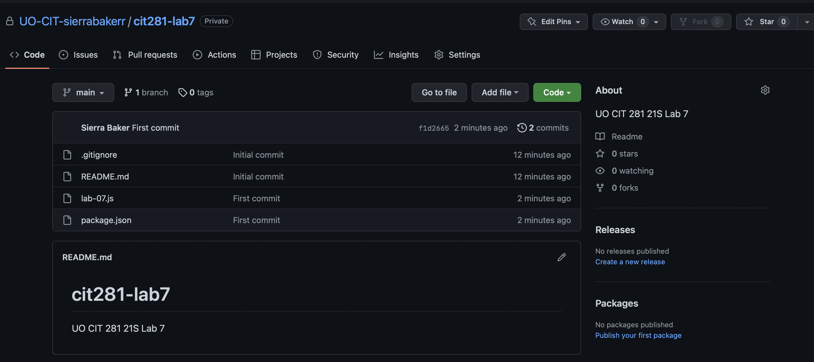

# Lab 7

[RETURN TO HOMEPAGE](https://sierrabakerr.github.io/)

## Lab goals and outcomes:

Part 1: Create your own GitHub organization for the CIT Minor

Part 2: Create your first GitHub repository

Part 3: Clone your GitHub repository to your local system

Part 4: Create lab JavaScript file, and initialize folder as a Node.js folder

Part 5: Update and commit lab JavaScript file to practice with error handling

Part 6: Push your changes to GitHub

## Lab Deliverables:

### 1. lab-07.js
[lab-07.js](lab-07.js)

### 2. lab-07.png

